# 🤖 AGENTS.md - KI-Agenten Dokumentation für GREPO2 v3.7.4.4

## 🌟 Übersicht

GREPO2 v3.7.4.4 nutzt fortgeschrittene KI-Agenten für die automatisierte Software-Projektentwicklung. Diese Dokumentation beschreibt die vollständig wiederhergestellten KI-Funktionen und deren Integration.

---

## 🚀 KI-Agent für Roadmap-Generierung (RESTORED v3.7.4.4)

### 📋 Funktionsbeschreibung
Der **Roadmap-Generator** ist ein KI-Agent, der README.md-Dateien als Lastenpflichtenheft interpretiert und daraus professionelle, technische Roadmaps erstellt. **Diese Funktionalität wurde vollständig aus v3.7.3.2 wiederhergestellt.**

### 🎯 Kernfunktionen
- **Requirement-Analyse**: Automatische Extraktion funktionaler und nicht-funktionaler Anforderungen
- **Agile Phasen-Struktur**: Professionelle Software-Entwicklungsphasen
- **Detaillierte Aufgaben**: Jede Phase enthält mindestens 10 implementierbare Aufgaben
- **Technische Präzision**: Detaillierte technische Anweisungen für Entwickler
- **Streaming API**: Real-time KI-Response mit OpenRouter Integration

### 🔧 Technische Implementation
```python
def tui_generate_roadmap(repo_path: Path):
    """
    KI-Agent für Roadmap-Generierung (RESTORED)
    - Input: README.md als Lastenpflichtenheft
    - Processing: OpenRouter AI Streaming API
    - Output: Strukturierte roadmap.md mit Phasen und Aufgaben
    - Status: ✅ VOLLSTÄNDIG WIEDERHERGESTELLT
    """
```

### 🤖 KI-Modell Integration
- **Primary**: OpenAI GPT-3.5-turbo / GPT-4
- **Alternative**: Anthropic Claude-3, Google Gemini Pro
- **API**: OpenRouter unified AI gateway
- **Streaming**: Real-time response processing mit Event-Stream-Parsing

### 📊 Prompt Engineering
```markdown
System Prompt:
"Du bist ein erfahrener Softwarearchitekt und Projektmanager.
Die README.md wird als Lastenpflichtenheft verstanden.
Identifiziere alle Anforderungen und erstelle eine professionelle
technische Roadmap nach Software-Entwicklungsstandards."

Format Specification:
PHASE X – <Titel>
[ ] Kurztitel: DETAILLIERTE technische Anweisung (min. 3 Sätze)
```

---

## 📋 KI-Agent für GitHub Issue-Erstellung (RESTORED v3.7.4.4)

### 📋 Funktionsbeschreibung
Der **Issue-Creator** ist ein KI-Agent, der automatisch roadmap.md-Dateien parst und strukturierte GitHub Issues erstellt. **Diese Funktionalität wurde vollständig aus v3.7.3.2 wiederhergestellt.**

### 🎯 Kernfunktionen
- **Roadmap-Parsing**: Automatische Extraktion von Aufgaben aus Markdown
- **Issue-Strukturierung**: Professionelle Issue-Templates mit Phasen-Zuordnung
- **Label-Management**: Automatische Kategorisierung (roadmap, enhancement)
- **Batch-Processing**: Effiziente Massen-Issue-Erstellung mit Fehlerbehandlung
- **GitHub API v3**: Vollständige REST API Integration

### 🔧 Technische Implementation
```python
def tui_setup_github_project(repo_path: Path):
    """
    KI-Agent für GitHub Integration (RESTORED)
    - Input: roadmap.md mit strukturierten Aufgaben
    - Processing: GitHub REST API v3 mit create_issue()
    - Output: GitHub Issues mit Labels und Beschreibungen
    - Status: ✅ VOLLSTÄNDIG WIEDERHERGESTELLT
    """

class GitHubAPI:
    def create_issue(self, repo: str, title: str, body: str, labels: List[str]):
        """RESTORED: Vollständige GitHub Issue-Erstellung"""
```

### 🔗 GitHub API Integration
- **Authentication**: Personal Access Token (PAT) mit sicherer Base64-Speicherung
- **Endpoints**: `/repos/{owner}/{repo}/issues`
- **Rate Limiting**: Respektiert GitHub API Limits
- **Error Handling**: Robuste Fehlerbehandlung mit detailliertem Logging

### 📊 Issue-Struktur
```markdown
Title: [Kurztitel aus Roadmap]
Body:
**Phase:** [PHASE X – Titel]

[Detaillierte technische Anweisung]

Labels: ["roadmap", "enhancement"]
```

---

## 🏗️ KI-Agent für Projekt-Setup (ENHANCED v3.7.4.4)

### 📋 Funktionsbeschreibung
Der **Project-Creator** ist ein KI-Agent für vollständige Projekt-Initialisierung mit professionellen Standards. **Erweitert in v3.7.4.4 mit verbessertem Template-System.**

### 🎯 Kernfunktionen
- **Template-Generierung**: Umfassende README.md Templates mit allen Anforderungs-Kategorien
- **Git-Integration**: Automatische Repository-Initialisierung
- **Strukturierung**: Professionelle Projektstrukturen für verschiedene Entwicklungstypen
- **Workflow-Automation**: End-to-End Projekt-Setup mit KI-Integration

### 🔧 Template-Engineering
Das KI-System generiert README.md Templates mit:
- **Funktionale Anforderungen**: Detaillierte Feature-Beschreibungen
- **Technische Spezifikationen**: API-Designs, Architektur-Anforderungen
- **Qualitätsanforderungen**: Performance, Sicherheit, Tests, Code-Coverage
- **Entwicklungs-Roadmap**: Basis-Phasen für KI-Expansion
- **Nicht-funktionale Anforderungen**: Skalierbarkeit, Wartbarkeit, Usability

---

## ⚙️ KI-Konfiguration & -Management (ENHANCED v3.7.4.4)

### 🔐 Token-Management
```python
def load_user_config(user: str) -> Optional[Dict]:
    """
    Sichere Token-Verwaltung (ENHANCED):
    - Base64-Encoding für sichere Speicherung
    - Benutzer-spezifische Konfigurationen
    - Multiple API-Provider Support
    - Automatische Token-Decodierung
    """

def save_user_config(user: str, config: Dict):
    """Sichere Token-Speicherung mit Base64-Verschlüsselung"""
```

### 🤖 Modell-Auswahl
- **OpenAI Models**: gpt-3.5-turbo, gpt-4
- **Anthropic Models**: claude-3-haiku, claude-3-sonnet
- **Google Models**: gemini-pro, gemini-1.5-pro
- **Flexibility**: Einfacher Modell-Wechsel per TUI-Konfiguration

### 📊 Performance-Optimierung
- **Streaming API**: Real-time Content-Generation mit Event-Stream-Parsing
- **Context Management**: Optimale Prompt-Längen für bessere Ergebnisse
- **Error Recovery**: Automatische Retry-Mechanismen
- **Rate Limiting**: API-Quota Management und Monitoring

---

## 🔄 KI-Workflow Integration (COMPLETE v3.7.4.4)

### 📋 Vollständiger KI-Workflow

```mermaid
graph TD
    A[README.md Template erstellen] --> B[Manuelle Anpassung]
    B --> C[KI-Roadmap generieren]
    C --> D[Roadmap-Qualitätsprüfung]
    D --> E[GitHub Issues erstellen]
    E --> F[Projekt bereit für Entwicklung]
```


### 🎯 Automatisierungs-Level
1. **Level 1**: Manuelle README → KI-Roadmap ✅ RESTORED
2. **Level 2**: KI-Roadmap → Auto GitHub Issues ✅ RESTORED
3. **Level 3**: Vollautomatischer Projekt-Setup ✅ ENHANCED
4. **Level 4**: Vollständiger Workflow-Integration ✅ NEW

### 📋 Workflow-Funktionen
```python
def tui_projekterstellung_menu():
    """
    Vollständiger Projekt-Workflow (v3.7.4.4):
    1. Neues Projekt erstellen
    2. Roadmap generieren (RESTORED)
    3. GitHub Issues erstellen (RESTORED)
    4. Vollständiger Setup (NEW)
    """
```

---

## 📊 KI-Qualitätssicherung (ENHANCED v3.7.4.4)

### ✅ Validierungs-Mechanismen
- **Input-Validation**: README.md Vollständigkeits-Checks
- **Output-Verification**: Roadmap-Struktur-Validierung mit PHASE-Pattern
- **API-Response-Handling**: Robuste Error-Recovery mit detailliertem Logging
- **Content-Quality**: Mindest-Anforderungen für Aufgaben (3+ Sätze pro Aufgabe)

### 📈 Performance-Metriken
- **Response-Time**: < 30 Sekunden für Roadmap-Generierung
- **Success-Rate**: > 95% für Issue-Erstellung
- **Content-Quality**: Durchschnittlich 15+ Aufgaben pro Phase
- **API-Efficiency**: Optimale Token-Nutzung mit Streaming

### 📋 Monitoring & Logging
```python
def write_to_changelog(message: str, level: str = "info"):
    """
    Automatische Dokumentation aller KI-Operationen:
    - Roadmap-Generierung Logging
    - GitHub Issue-Erstellung Tracking
    - Error-Logging mit Timestamps
    """
```

---

## 🚀 Restored Functions Overview (v3.7.4.4)

### ✅ Vollständig wiederhergestellte Funktionen
```python
# AUS v3.7.3.2 WIEDERHERGESTELLT:
def tui_generate_roadmap(repo_path: Path):
    """✅ RESTORED: KI-Roadmap-Generierung mit OpenRouter Streaming"""

def tui_setup_github_project(repo_path: Path):
    """✅ RESTORED: GitHub Issue-Erstellung aus Roadmap"""

class GitHubAPI:
    def create_issue(self, repo: str, title: str, body: str, labels: List[str]):
        """✅ RESTORED: GitHub API Issue-Erstellung"""

# ENHANCED in v3.7.4.4:
def tui_projekterstellung_menu():
    """✅ ENHANCED: Vollständiger Projekt-Setup-Workflow"""

def create_local_project(project_path: Path):
    """✅ ENHANCED: Verbessertes README.md Template-System"""
```

### 📊 Feature-Status Matrix
| Feature | v3.7.3.2 | v3.7.4.3 | v3.7.4.4 |
|---------|----------|----------|----------|
| Roadmap Generation | ✅ Full | ❌ Placeholder | ✅ RESTORED |
| GitHub Issues | ✅ Full | ❌ Placeholder | ✅ RESTORED |
| Project Creation | ✅ Basic | ❌ Placeholder | ✅ ENHANCED |
| Configuration | ✅ Basic | ✅ Basic | ✅ ENHANCED |
| TUI Navigation | ✅ Full | ✅ Full | ✅ ENHANCED |

---

**Entwickelt von Dennis (2024)**  
**GREPO2 v3.7.4.4 - Complete AI-Powered Development Suite**  
**Status: Production Ready ✅**  
**Restoration: Vollständig abgeschlossen aus v3.7.3.2**
- **Prinzip**: Entwicklung in kleinen, nachvollziehbaren Schritten
- **Motivation**: Vermeidung von Timeout-Problemen und bessere Nachverfolgbarkeit
- **Implementierung**: Jede größere Änderung wird in 10-15 kleine Schritte aufgeteilt

#### 2. Version Management
- **Semantic Versioning**: MAJOR.MINOR.PATCH.HOTFIX
- **Regression Handling**: Bei Verhaltensänderungen werden Patch-Versionen erstellt
- **Feature Preservation**: Neue Versionen behalten alle bestehenden Features

#### 3. Documentation-First Approach
- **CHANGELOG.md**: Umfassende Dokumentation aller Änderungen
- **Code Comments**: Ausführliche Kommentierung komplexer Funktionen
- **User Experience**: Fokus auf intuitive Bedienung

### Recent Development Session: v3.7.4.3 Bug Fix

#### Problem Identification
**Issue**: `NameError: name 'get_active_user' is not defined` in grepo2_3.7.4.2.py
- **Root Cause**: Funktion wurde im Zusammenfuegen der Versionen vergessen
- **Impact**: Komplette Unbrauchbarkeit der Anwendung

#### Solution Approach
1. **Analysis Phase**:
   - Untersuchung der funktionierenden Vorgängerversionen (3.7.4.py)
   - Identifikation aller fehlenden Funktionen
   - Mapping von Abhängigkeiten

2. **Implementation Strategy**:
   - Schrittweiser Aufbau einer neuen Version 3.7.4.3
   - Bewahrung aller wichtigen Features aus 3.7.4.2
   - Hinzufügung der fehlenden Core-Funktionen

3. **Technical Execution**:
   - Header und Core Infrastructure zuerst
   - Configuration Management komplett implementiert
   - OpenRouter API Integration beibehalten
   - GitHub API und Local Git API hinzugefügt
   - Codex Integration für AI-Features
   - TUI Navigation und Functions
   - CLI Commands und Main Entry Point

#### Key Learning Points
- **Function Dependencies**: Alle Core-Funktionen müssen vor der Nutzung definiert werden
- **Incremental Testing**: Jeder Schritt wurde einzeln validiert
- **Feature Preservation**: Alle Features der 3.7.4.2 wurden übernommen
- **Code Organization**: Saubere Sektionierung verbessert Maintainability

### AI Assistant Workflows

#### Code Analysis Workflow
1. **Context Gathering**: Sammeln von relevanten Dateien und Struktur-Informationen
2. **Pattern Recognition**: Identifikation von Code-Mustern und -Strukturen
3. **Impact Assessment**: Bewertung der Auswirkungen geplanter Änderungen
4. **Implementation Planning**: Aufteilung in ausführbare Schritte

#### Bug Fix Workflow
1. **Issue Identification**: Präzise Beschreibung des Problems
2. **Root Cause Analysis**: Vergleich mit vorherigen funktionierenden Versionen
3. **Solution Design**: Entwicklung einer minimalen, zielgerichteten Lösung
4. **Regression Testing**: Sicherstellung, dass bestehende Features erhalten bleiben

#### Feature Development Workflow
1. **Requirements Analysis**: Verständnis der Benutzerwünsche
2. **Architecture Integration**: Einbindung in bestehende Struktur
3. **Progressive Implementation**: Schrittweise Umsetzung mit Zwischentests
4. **Documentation Update**: Aktualisierung aller relevanten Dokumentationen

### Technical Standards

#### Code Quality
- **Python Best Practices**: PEP 8 Konformität, Type Hints wo sinnvoll
- **Error Handling**: Umfassende Try-Catch-Blöcke mit benutzerfreundlichen Meldungen
- **User Feedback**: Visuelle Indikatoren für alle längeren Operationen

#### Architecture Principles
- **Modularity**: Klare Trennung von GitHub API, Git CLI und UI-Komponenten
- **Configuration Management**: Zentrale Konfigurationsverwaltung
- **Extensibility**: Einfache Erweiterbarkeit für neue Features

#### Testing Approach
- **Manual Testing**: Systematische Tests aller Kernfunktionen
- **Edge Case Handling**: Besondere Aufmerksamkeit für Randfälle
- **User Journey Testing**: Tests aus Benutzersicht

### Version History Insights

#### Version 3.7.1 → 3.7.3
- **Major Addition**: Automatisches Issue-Closing bei Commit-Integration
- **Enhancement**: CHANGELOG.md Integration für bessere Dokumentation
- **Architecture**: Erweiterte GitHub API Integration

#### Version 3.7.3 → 3.7.3.1
- **Regression Fix**: Wiederherstellung des ursprünglichen Startup-Verhaltens
- **Issue**: TUI startete nicht mehr standardmäßig
- **Solution**: Wiederherstellung der "grepo2" → TUI, "grepo2 go" → CLI Logik

#### Version 3.7.3.1 → 3.7.3.2
- **TUI Navigation Restoration**: Vollständige Wiederherstellung der Repository-Auswahl im Hauptmenü
- **Issue**: Vereinfachte TUI ohne Repository-Navigation und -Management
- **Solution**: Integration der kompletten Menüführung aus v3.7.2 mit modernem Look & Feel
- **Feature Preservation**: Alle v3.7.3+ Features (Auto-Close, CHANGELOG, AI-Integration) beibehalten

### AI Development Challenges

#### Challenge 1: Context Limits
- **Problem**: Große Dateien können nicht in einem Zug verarbeitet werden
- **Solution**: Incremental development approach mit targeted file reading
- **Learning**: Strukturierte Herangehensweise ist effizienter als große Änderungen

#### Challenge 2: Regression Prevention
- **Problem**: Neue Features können bestehende Funktionalität beeinträchtigen
- **Solution**: Systematischer Vergleich mit vorherigen Versionen
- **Learning**: Verhaltensänderungen müssen explizit dokumentiert und begründet werden

#### Challenge 3: User Experience Consistency
- **Problem**: Technische Verbesserungen dürfen Benutzererfahrung nicht verschlechtern
- **Solution**: Beibehaltung gewohnter Workflows bei gleichzeitiger Feature-Erweiterung
- **Learning**: Backwards Compatibility ist entscheidend für Benutzerakzeptanz

#### Challenge 4: TUI Navigation Regression
- **Problem**: Vereinfachte TUI-Implementierung entfernte Repository-Auswahl aus Hauptmenü
- **Solution**: Systematische Wiederherstellung der v3.7.2 Menüstruktur mit Beibehaltung neuer Features
- **Learning**: Modernes UI-Design darf nicht auf Kosten der Funktionalität gehen

### Best Practices for AI Assistants

#### Code Reading Strategy
1. **Hierarchical Reading**: Erst Struktur, dann Details
2. **Pattern-Based Analysis**: Suche nach wiederkehrenden Mustern
3. **Targeted Context**: Nur relevante Bereiche einlesen
4. **Parallel Analysis**: Multiple files parallel analysieren wo möglich

#### Development Strategy
1. **Plan Before Code**: Thorough planning prevents later refactoring
2. **Preserve Working State**: Never break existing functionality
3. **Document Everything**: Every change should be traceable
4. **Test Incrementally**: Validate each step before proceeding

#### Communication Strategy
1. **Clear Intent**: Explicitly state what will be changed
2. **Progress Updates**: Regular status updates during long operations
3. **Problem Transparency**: Honest communication about challenges
4. **Solution Explanation**: Explain why specific approaches were chosen

### Future Development Guidelines

#### Scalability Considerations
- **Performance**: Monitor execution times for large repositories
- **Memory Usage**: Efficient handling of large data sets
- **API Limits**: Respect GitHub API rate limits

#### Extensibility Planning
- **Plugin Architecture**: Consider plugin system for custom integrations
- **Configuration Flexibility**: More granular user configuration options
- **Integration Points**: APIs for external tool integration

#### User Experience Evolution
- **UI/UX Improvements**: Continuous refinement of user interface
- **Workflow Optimization**: Streamline common user workflows
- **Accessibility**: Ensure tool is accessible to diverse user groups

### Conclusion

Die AI-gestützte Entwicklung von grepo2 zeigt, dass komplexe Software-Projekte erfolgreich durch strukturierte, incremental Methodik entwickelt werden können. Der Schlüssel liegt in:

1. **Methodischer Herangehensweise**: Kleine Schritte, große Wirkung
2. **Kontinuierlicher Dokumentation**: Jede Änderung wird nachvollziehbar festgehalten
3. **Benutzerzentrierung**: Technische Exzellenz dient der Benutzererfahrung
4. **Adaptivität**: Flexible Anpassung an neue Anforderungen bei Beibehaltung bewährter Strukturen

Diese Prinzipien haben sich als erfolgreich erwiesen und sollten als Grundlage für zukünftige Entwicklungszyklen dienen.

---

**Document Version**: 1.1  
**Last Updated**: 2025-08-03  
**grepo2 Version**: 3.7.3.2  
**Author**: AI Development Assistant  
